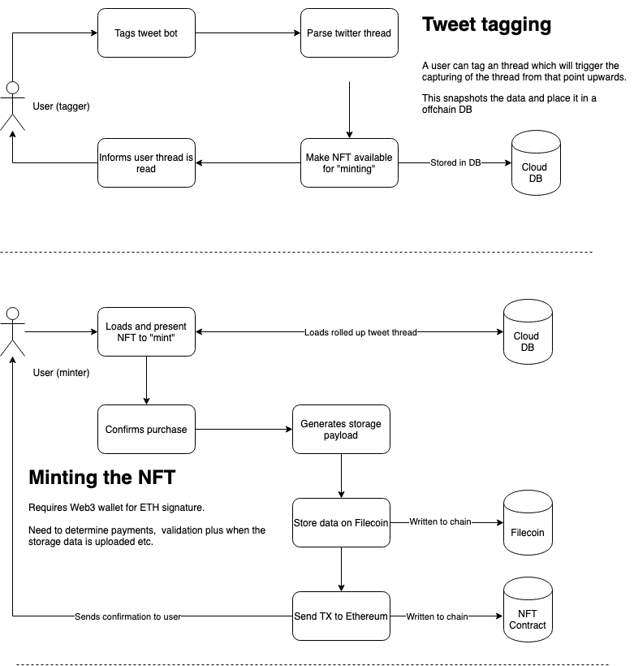
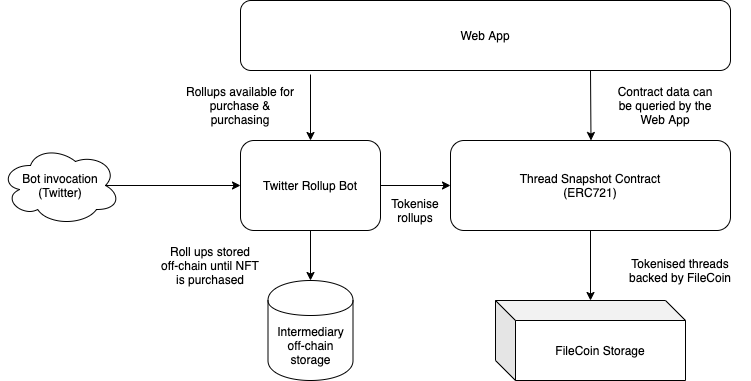

# NFTSnapshot-Bot
Filecoin and ethereum-based twitter thread tokenisation bot.

Simply reply to a twitter thread with @EthTimestamp and wait for the bot to let you know when the thread has been rolled up ready for purchase.

## Project breakdown

* [documentation](./documentation) - Some high level docs on how it works
* [bot](./bot) - A twitter bot which rolls up a twitter thread ready for tokenising
* [smart-contracts](./smart-contracts) - The ETH smart contracts which are responsible for issuing the NFTs
* [dapp](./dapp) - An SSR webapp where a user purchase and tokenise rolled up threads
* [powergate](https://github.com/textileio/powergate) - Getting powergate going

A demo fo the working application can be seen [here](https://drive.google.com/file/d/1oqAP_7B9iGms1IZ-nz-2wYP_yofVFjGu/view?usp=sharing)

Run `npm run start` to run the bot locally.

Create a `.env` file populated with the correct env vars (see `.env.example`).

### User Journey
 
 

### General architecture

 

## License

This work is dual-licensed under Apache 2.0 and MIT.

`SPDX-License-Identifier: Apache-2.0 OR MIT`
