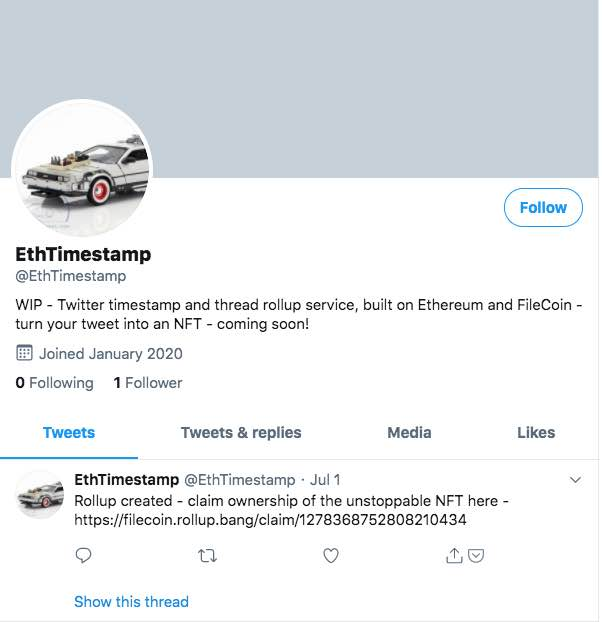

# NFT-Snapshot-Bot
Filecoin and Ethereum-based NFT Snapshot Bot for Twitter threads

[Demo video](https://drive.google.com/file/d/1oqAP_7B9iGms1IZ-nz-2wYP_yofVFjGu/view?usp=sharing) of the working application

 

https://twitter.com/EthTimestamp
 

This project was built as a Wave 2 [Filecoin dev grant](https://github.com/filecoin-project/devgrants#filecoin-devgrants).

## Project Description

A decentralized app / bot that will support creating Twitter thread rollup snapshots that can be turned into tradable Ethereum NFTs (non-fungible tokens) with the data stored on Filecoin. 

Twitter thread rollup and timestamp bots do not currently utilize distributed, decentralised storage, such as the Filecoin network nor do they allow creators to turn them into tradable NFTs (non-fungible tokens) defined by Ethereum ERC-721.

Existing bots / solutions traditionally rely on centralised (hidden) storage and therefore are limited in what can be done with the thread that is snapshotted. Filecoin also adds to IPFS verifiable proof of storage.

## Architecture

## User Flow

## Source code

- The source code is available at https://github.com/blockrockettech/NFTSnapshot-Bot/

## License

All linked repos for this project are dual-licensed under

[MIT](https://github.com/filecoin-project/lotus/blob/master/LICENSE-MIT)

[Apache 2.0](https://github.com/filecoin-project/lotus/blob/master/LICENSE-APACHE)
